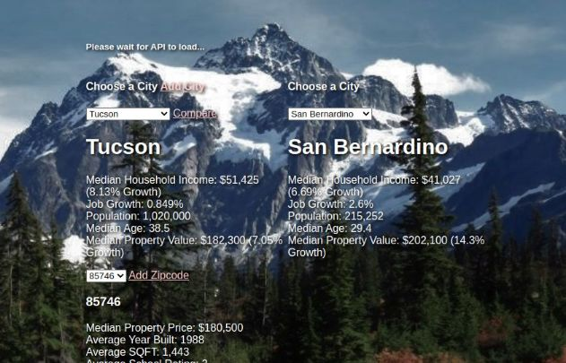

# Citidex 

## Description

CMS SPA built using HTML, CSS, and vanilla JS. 

After watching a bunch of Graham Stephen videos, I was looking into homes and locations to buy my first rental property. I built this application to help me catalog all the homes and cities I looked into during my home search.

[Deployed using Heroku](https://citidex.herokuapp.com/)

[API used](https://github.com/arthurysong/real-estate-app)

## Screenshot

## Usage 

- Create a city profile using "Add City"
- View City profile by using dropdown menu
- Compare two city profiles using "Compare"
- Cities can be big and contain a wide array of demographics. Organize city into zipcodes: add or view Zipcodes in a city.
- Add homes that you've been browsing at into "homes". Citidex will calculate stats i.e. median property price, avg. year built, avg. SQFT.
- You can also view homes in the area.

## Development

- For the repository and clone it to your machine
- Serve html file using `http-server`